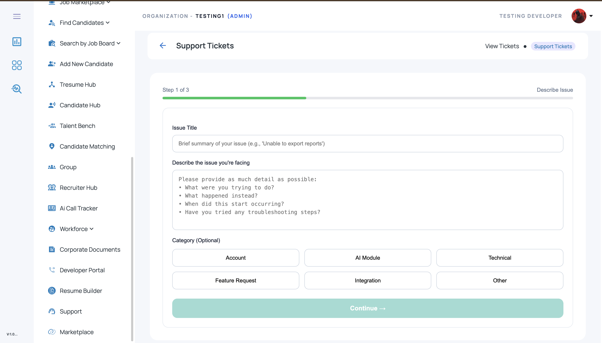
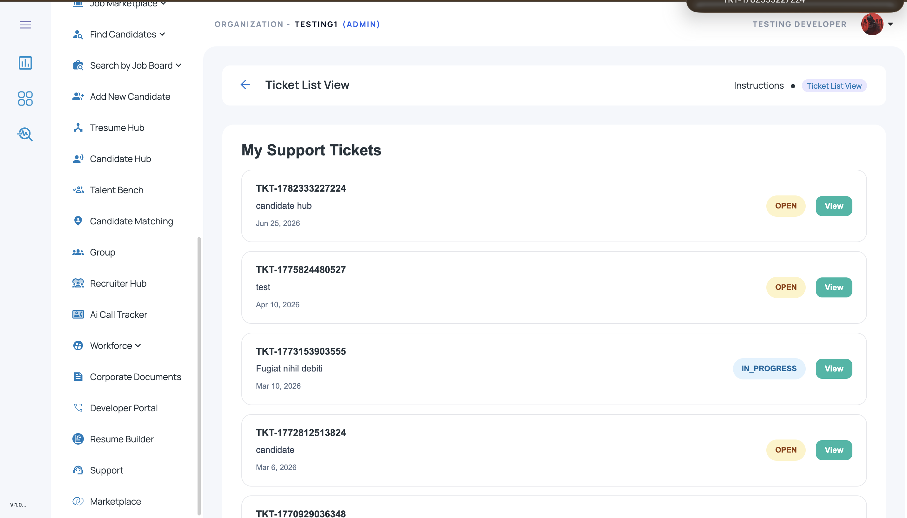
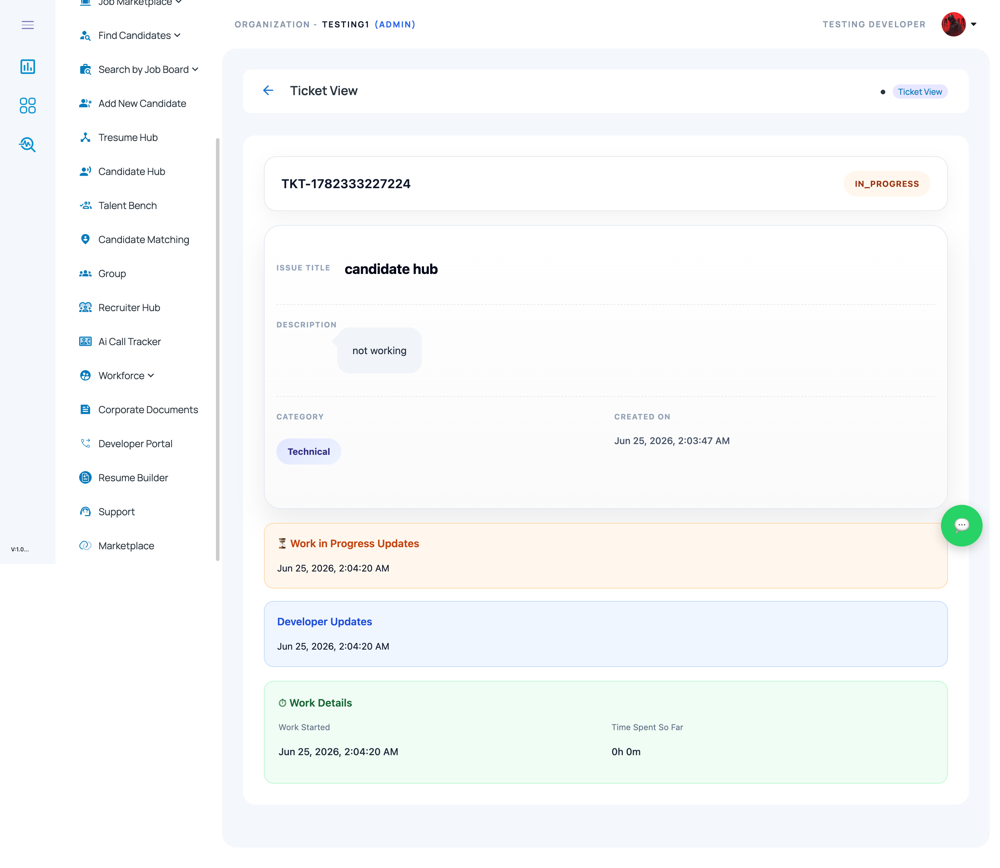
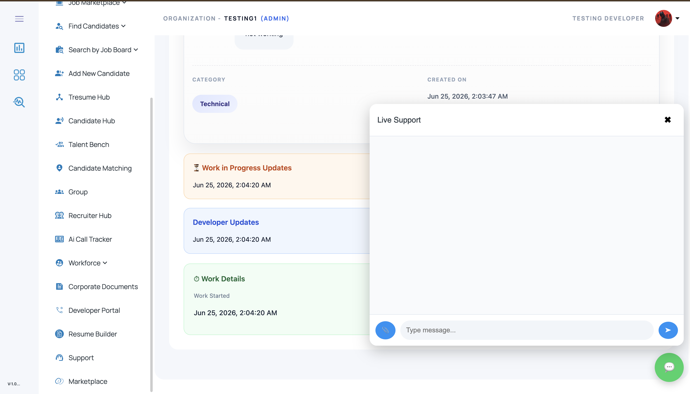
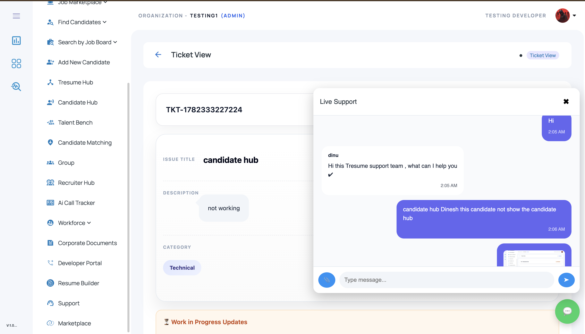
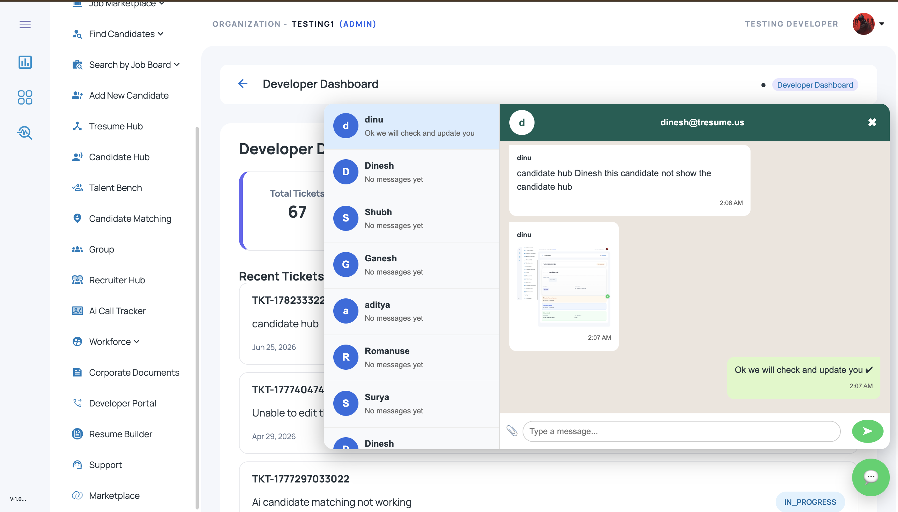

# Support Ticket & Live Chat System

A **support ticket and live chat platform** built with **Angular**, **Node.js**, **Socket.IO**, and **Microsoft SQL Server** for handling user-reported issues, developer updates, and real-time support conversations.

This module is designed for ATS / HRMS / enterprise platforms where users can raise support tickets, track issue progress, and communicate directly with developers or support teams.

---

## 🚀 Overview

The **Support Ticket & Live Chat System** helps users report issues in a structured way and enables developers/support teams to manage ticket resolution through ticket status tracking and real-time chat.

It supports the full issue resolution workflow:

* users submit support tickets
* tickets are categorized and tracked
* developers view ticket details and update progress
* users and support teams communicate via live chat
* ticket history, work progress, and updates remain visible in one place

This module is useful for **SaaS products, ATS/HRMS platforms, internal support portals, and enterprise issue management systems**.

---

## ✨ Features

## 1) Support Ticket Submission

Users can raise tickets by entering:

* issue title
* issue description
* category / issue type
* optional additional notes
* screenshots / documents / attachments

### Example issue categories:

* Technical
* AI Module
* Integration
* Account
* Feature Request
* Other

---

## 2) Ticket List View

Displays all created support tickets with:

* ticket ID
* issue title / summary
* created date
* ticket status
* quick **View** action

### Supported statuses:

* **Open**
* **In Progress**
* **Resolved** *(future-ready if needed)*

---

## 3) Ticket Detail View

Detailed ticket page includes:

* ticket ID
* issue title
* description
* category
* created date
* work progress updates
* developer updates
* work start time / time spent
* issue resolution tracking

---

## 4) Multi-Step Ticket Form

Structured issue reporting flow with step-based UI:

* Step 1 → Describe issue
* Step 2 → Add details / attachments
* Step 3 → Submit ticket

This helps collect clean and actionable issue data from users.

---

## 5) Live Chat Between User and Developer

Real-time support chat enables:

* user-to-support / developer conversation
* issue clarification inside ticket context
* text messaging
* screenshot / attachment sharing
* developer reply tracking
* chat history inside support workflow

---

## 6) Developer Support Dashboard

Developer-side dashboard can be used to:

* view recent support tickets
* open live chat conversations
* monitor ticket workload
* respond to user issues faster
* manage multiple support conversations

---

## 🛠️ Tech Stack

### Frontend

* **Angular**
* **TypeScript**
* **HTML5**
* **SCSS / CSS**
* **Angular Material**

### Backend

* **Node.js**
* **Express.js**
* **Socket.IO** (for live chat / real-time communication)

### Database

* **Microsoft SQL Server**

---

## 📂 Project Structure

```bash id="ay3m0q"
support-ticket-live-chat/
│
├── frontend/                             # Angular application
│   ├── src/
│   │   ├── app/
│   │   │   ├── components/
│   │   │   │   ├── support-ticket-form/
│   │   │   │   ├── ticket-list/
│   │   │   │   ├── ticket-detail/
│   │   │   │   ├── live-chat/
│   │   │   │   └── developer-dashboard/
│   │   │   ├── services/
│   │   │   ├── models/
│   │   │   └── shared/
│   │   ├── assets/
│   │   └── environments/
│   └── angular.json
│
├── backend/                              # Node.js / Express backend
│   ├── routes/
│   ├── controllers/
│   ├── socket/
│   ├── db/
│   ├── config/
│   └── server.js
│
├── database/
│   └── schema.sql
│
├── screenshots/
│   ├── support-ticket-form.png
│   ├── ticket-list-view.png
│   ├── ticket-detail-view.png
│   ├── live-chat-user.png
│   ├── live-chat-conversation.png
│   └── developer-chat-dashboard.png
│
└── README.md
```

---

## 🖥️ Core UI Screens

## 1. Support Ticket Form

Users can submit issues using a structured form with:

* issue title
* issue description
* category selection
* additional notes
* file upload for screenshots / documents

---

## 2. Ticket List View

Displays support tickets in a clean list layout with:

* ticket number
* issue title
* created date
* current status
* **View** action

---

## 3. Ticket Detail View

Displays complete ticket information including:

* issue title and description
* category
* created date
* progress status
* work updates
* developer updates
* work details section

---

## 4. Live Support Chat

Allows users to chat with support or developers directly from the ticket screen:

* real-time messages
* attachments / screenshots
* support reply thread
* issue-specific communication

---

## 5. Developer Chat Dashboard

Shows support chat conversations for developers/support team:

* list of active chats
* recent ticket context
* real-time conversation panel
* reply box for support team

---

## 📸 Screenshots

### Support Ticket Form



### Ticket List View



### Ticket Detail View



### Live Chat (User View)



### Live Chat Conversation



### Developer Chat Dashboard



> Create a folder named **`screenshots`** in the repo root and add your screenshots using these names:

* `support-ticket-form.png`
* `ticket-list-view.png`
* `ticket-detail-view.png`
* `live-chat-user.png`
* `live-chat-conversation.png`
* `developer-chat-dashboard.png`

---

## 🔄 Typical Workflow

1. User opens **Support Tickets**
2. Enters issue title and issue description
3. Selects category
4. Uploads screenshot / supporting document
5. Submits ticket
6. Ticket is added to **My Support Tickets**
7. User opens ticket detail page
8. Developer / support team adds work updates
9. User and developer communicate through **Live Support Chat**
10. Ticket status moves from **Open → In Progress → Resolved**

---

## 🧪 Example Ticket JSON

```json id="8f4twa"
{
  "ticketId": "TKT-1782333227224",
  "title": "Candidate Hub not working",
  "description": "Candidate list is not loading in Candidate Hub.",
  "category": "Technical",
  "status": "IN_PROGRESS",
  "createdAt": "2026-06-25T02:03:47",
  "attachments": [
    "candidate-hub-error.png"
  ],
  "updates": [
    {
      "type": "WORK_IN_PROGRESS",
      "message": "Issue has been picked up by developer team.",
      "createdAt": "2026-06-25T02:04:20"
    }
  ]
}
```

---

## 💬 Example Chat Message JSON

```json id="gptnve"
[
  {
    "sender": "user",
    "message": "Candidate hub is not showing candidates.",
    "createdAt": "2026-06-25T02:06:00"
  },
  {
    "sender": "developer",
    "message": "We will check and update you shortly.",
    "createdAt": "2026-06-25T02:07:00"
  }
]
```

---

## 🗄️ Example SQL Table Structure

### Support Tickets Table

```sql id="7f1nd2"
CREATE TABLE SupportTickets (
    TicketId NVARCHAR(50) PRIMARY KEY,
    Title NVARCHAR(250) NOT NULL,
    Description NVARCHAR(MAX),
    Category NVARCHAR(100),
    Status NVARCHAR(50) DEFAULT 'OPEN',
    CreatedBy INT NULL,
    AssignedTo INT NULL,
    CreatedAt DATETIME DEFAULT GETDATE(),
    UpdatedAt DATETIME DEFAULT GETDATE()
);
```

### Ticket Attachments Table

```sql id="93m7ph"
CREATE TABLE TicketAttachments (
    AttachmentId INT IDENTITY(1,1) PRIMARY KEY,
    TicketId NVARCHAR(50) NOT NULL,
    FileName NVARCHAR(255),
    FilePath NVARCHAR(MAX),
    UploadedAt DATETIME DEFAULT GETDATE(),
    FOREIGN KEY (TicketId) REFERENCES SupportTickets(TicketId)
);
```

### Ticket Updates Table

```sql id="x8rk5u"
CREATE TABLE TicketUpdates (
    UpdateId INT IDENTITY(1,1) PRIMARY KEY,
    TicketId NVARCHAR(50) NOT NULL,
    UpdateType NVARCHAR(100),
    UpdateMessage NVARCHAR(MAX),
    CreatedBy NVARCHAR(100),
    CreatedAt DATETIME DEFAULT GETDATE(),
    FOREIGN KEY (TicketId) REFERENCES SupportTickets(TicketId)
);
```

### Ticket Chat Messages Table

```sql id="r4k2ts"
CREATE TABLE TicketChatMessages (
    MessageId INT IDENTITY(1,1) PRIMARY KEY,
    TicketId NVARCHAR(50) NOT NULL,
    SenderId INT NULL,
    SenderRole NVARCHAR(50),
    MessageText NVARCHAR(MAX),
    AttachmentPath NVARCHAR(MAX),
    CreatedAt DATETIME DEFAULT GETDATE(),
    FOREIGN KEY (TicketId) REFERENCES SupportTickets(TicketId)
);
```

---

## ⚙️ Setup Instructions

## 1) Clone the repository

```bash id="pwn9jv"
git clone https://github.com/YOUR-USERNAME/support-ticket-live-chat.git
cd support-ticket-live-chat
```

---

## 2) Frontend setup (Angular)

```bash id="4f95x0"
cd frontend
npm install
ng serve
```

Open in browser:

```bash id="f8k1rp"
http://localhost:4200
```

---

## 3) Backend setup (Node.js)

```bash id="0w8n2m"
cd backend
npm install
npm start
```

---

## 4) Database setup (Microsoft SQL Server)

* Create a SQL Server database
* Run schema files from the `database/` folder
* Update SQL connection config in backend

Example config:

```js id="qu7v3e"
const config = {
  user: "your_sql_username",
  password: "your_sql_password",
  server: "localhost",
  database: "SUPPORT_TICKET_DB",
  options: {
    trustServerCertificate: true
  }
};
```

---

## 🔌 Example API Endpoints

### Ticket APIs

* `POST /api/tickets` → create support ticket
* `GET /api/tickets` → fetch all user tickets
* `GET /api/tickets/:ticketId` → fetch ticket details
* `POST /api/tickets/:ticketId/update` → add developer / work update
* `POST /api/tickets/:ticketId/attachment` → upload attachment

### Chat APIs / Real-time events

* `GET /api/tickets/:ticketId/chat` → fetch chat history
* `socket.emit("join-ticket-room", ticketId)` → join ticket chat room
* `socket.emit("send-ticket-message", payload)` → send chat message
* `socket.on("receive-ticket-message", callback)` → receive live chat messages

---

## 📈 Use Cases

This project can be used as a demo / reference implementation for:

* internal support desk systems
* ATS / HRMS support workflows
* SaaS product issue tracking
* developer-user communication tools
* enterprise support chat and ticketing systems

---

## 🔒 Important Note

This repository should be published as a **demo / showcase version** only.
Do **not** upload:

* production user tickets
* real customer conversations
* internal screenshots containing private data
* real database credentials
* internal support agent emails / private identifiers
* `.env` files with secret keys

Use **mock / sanitized data** for public GitHub uploads.

---

## 🚀 Future Improvements

* ticket SLA / priority tracking
* assign ticket to specific developer
* typing indicator in live chat
* unread message count
* push / email notifications
* attachment preview inside chat
* admin analytics dashboard
* ticket reopen / close flow
* chatbot-assisted first response

---

## 👨‍💻 Author

**Dinesh M**
Software Developer | Angular · Node.js · Microsoft SQL Server · ATS / HRMS · AI Automation

* GitHub: https://github.com/Dinesh-T-2005
* LinkedIn: https://www.linkedin.com/in/dinesh-m-a5698b330/
* Email: [dinesh996528@gmail.com](mailto:dinesh996528@gmail.com)

---

## 📄 License

This project is shared for learning, demonstration, and portfolio purposes.
